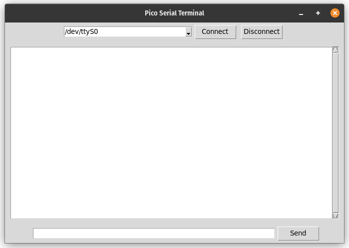
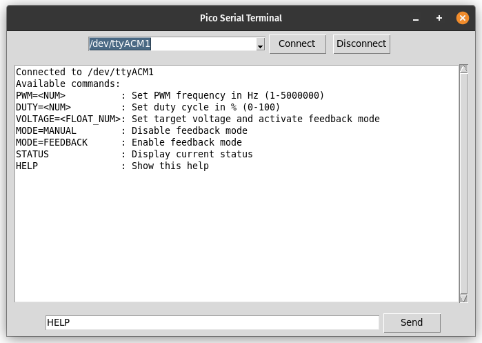

## Usage Introduction

- Refer [Flashing Instructions](Readme.md) to flash the Board
1. The Raspberry Pi Pico Runs automatically on Power Up after Flashing.
2. you need to run the [PC_GUI.exe](PC_GUI/Windows/PC_GUI.exe) to communicate with the PICO.

## PC GUI Brief


1. you need to run the PC_GUI.exe to commuicate with the PICO
2. First , you need to Select the COM PORT to which the USB is connected to from the Dropdown and click Connect
3. if you connect during the Raspi Pico Boot-up sequence, you will see the information about the Available Commands in the Message Section
4. You can Send messages to the Pico Board in the defined Format shown in the Available Commands message
5. you can send HELP to get the full imformation on the type of and the Format in which the Messages have to sent and Received


## RASPI PICO Firmware Breif
1. Upon Power Up, the Micro-cotroller will have a boot-up time of 5 Seconds (indicated by a fast blikig LED on the Pico)
2. The LED blinks slowly after 5 seconds indicating Boot-up is Done
3. after Boot-Up, if PC GUI is opened, Command Innformatio will be printed
    ```console
    PWM=<NUM>          : Set PWM frequency in Hz (1-5000000)
    DUTY=<NUM>         : Set duty cycle in % (0-100)
    VOLTAGE=<FLOAT_NUM>: Set target voltage and activate feedback mode
    MODE=MANUAL        : Disable feedback mode
    MODE=FEEDBACK      : Enable feedback mode
    STATUS             : Display current status
    HELP               : Show this help
    ```
4. default Values on Boot-Up
    ```cosole
    Mode: Manual
    Frequency: 100000 Hz
    Duty: 50%
    Target: 5.0V
    Actual: 3.78V
    ```

## Commads Explaied
### 1. Mode:
- options : MANUAL or FEEDBACK
- #### Manual Mode: 
    - the PWM frequency and Duty Cycle will be hardcoded andf will stay fixed as the Iputted PWM and DUTY commands
    - there won't be any Voltage Feedback correction i this mode
    - you can still access the Voltage readings using STATUS command
- #### FEEDBACK Mode:
    - in this Mode, the PWM Duty cycle is Auto adjusted to keep the Voltage constant at the inputted VOLTAGE Value
    - the PWM Duty Cycle will be adjusted in realtime on the Live feedback voltage
    - Note that in this Mode , the PWM Frequency will still be Constant as per the Inputted FREQUENCY input

### 2. FREQUENCY:
- input type : Number in Hz(only positive integer)
- this command sets the PWM Frequecy
- this Frequency remains constant in Both MANUAL and FEEDBACK modes

### 3. DUTY:
- input type : Number from 0 to 100 (decimals allowed)
- this command sets the Duty Cycle in MANUAL Mode

### 4. VOLTAGE:
- input type : Number from 0 to 20 (decimals allowed)
- this command Sets the Target Voltage output of Buck converter in FEEDBACK mode
- changing this Voltage will automatically switches the Mode to FEEDBACK

### 5. STATUS:
- this command retrieves the current state of settings and Voltages like below
    ```cosole
    Mode: Manual
    Frequency: 100000 Hz
    Duty: 50%
    Target: 5.0V
    Actual: 3.78V
    ```

### 6. HELP:
- this command prints all the Available Commands and their usage Information like below
    ```console
    PWM=<NUM>          : Set PWM frequency in Hz (1-5000000)
    DUTY=<NUM>         : Set duty cycle in % (0-100)
    VOLTAGE=<FLOAT_NUM>: Set target voltage and activate feedback mode
    MODE=MANUAL        : Disable feedback mode
    MODE=FEEDBACK      : Enable feedback mode
    STATUS             : Display current status
    HELP               : Show this help
    ```
