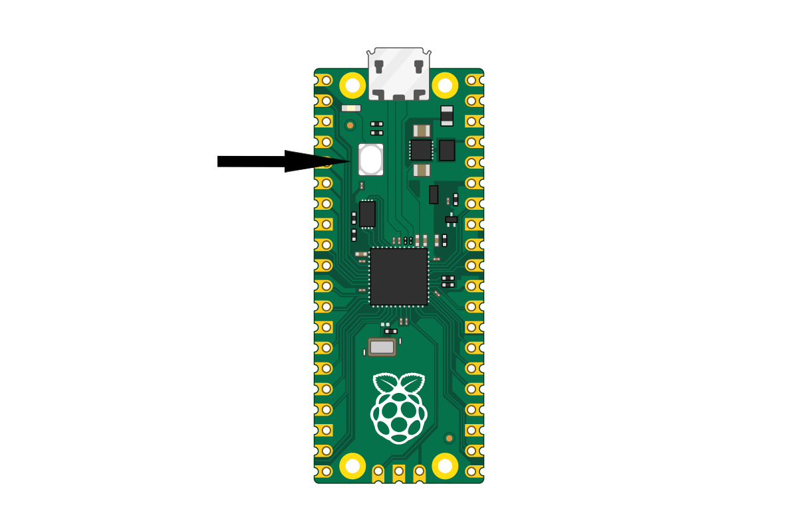
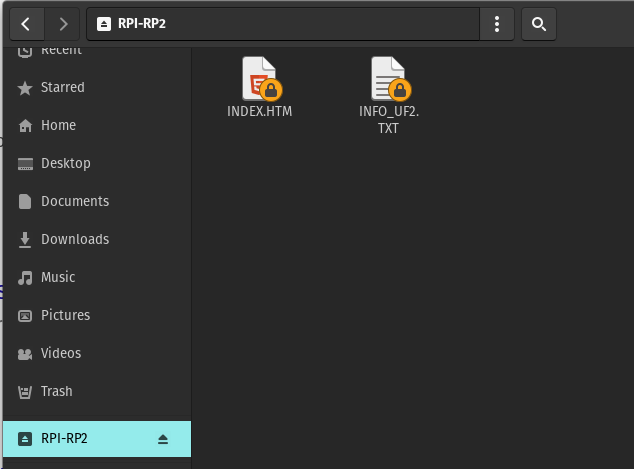
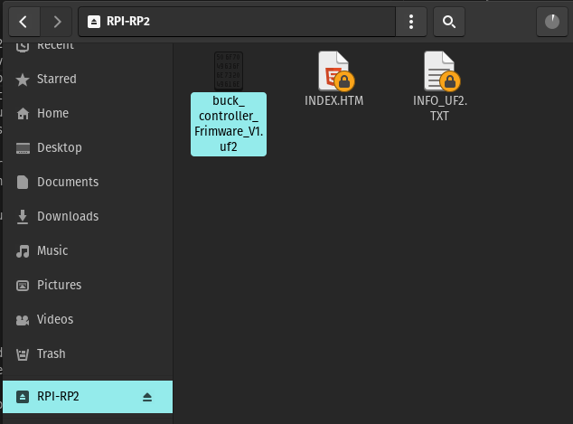
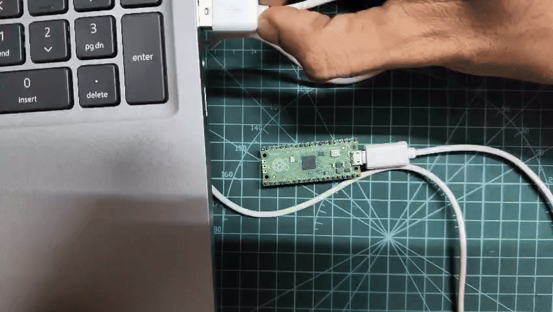

## Firmware File : [Frimware .UF2 file](buck_controller_Frimware_V1.uf2)
## PC GUI Executable : 
- ## windows : [PC_GUI.exe](PC_GUI/Windows/PC_GUI.exe)
- ## Linux :   [PC_GUI.x](PC_UI/Linux/dist/PC_GUI)

## Flashing Instructions
1. Press the BOOTSEL button and hold it while you connect the other end of the micro USB cable to your computer

2. The Board will show up as "RPI-RP2" Filesystem / Folder in files manager

3. Copy the Firmware file [buck_controller_Frimware_V1.uf2](buck_controller_Frimware_V1.uf2) and paste it in the Filesystem

4. after Copying is done, Un-plug ad Plug the USB (Power Restart)

5. if you see a fast blinking LED for 5 Seconds followed by a Continous Slow blinking, then Firmware flash is successful

